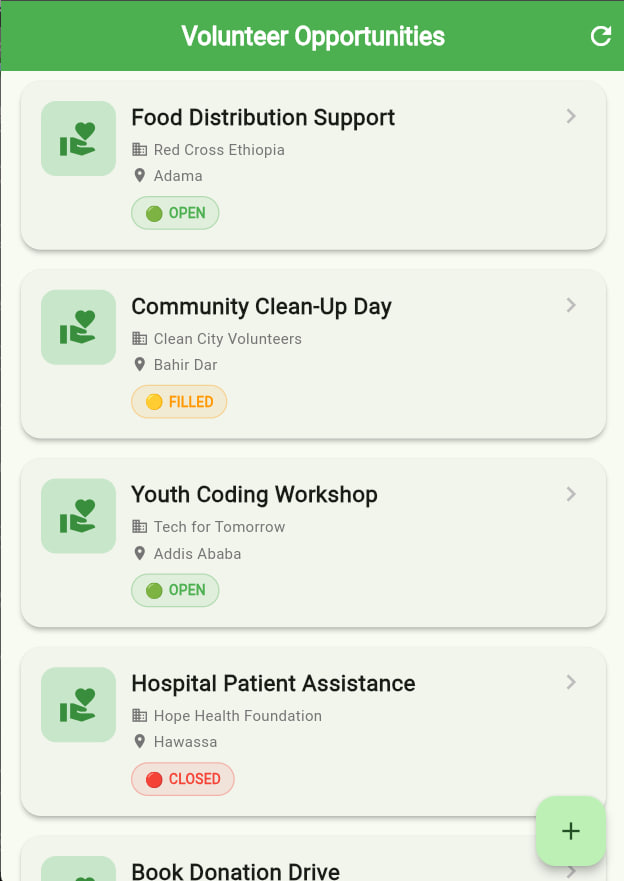
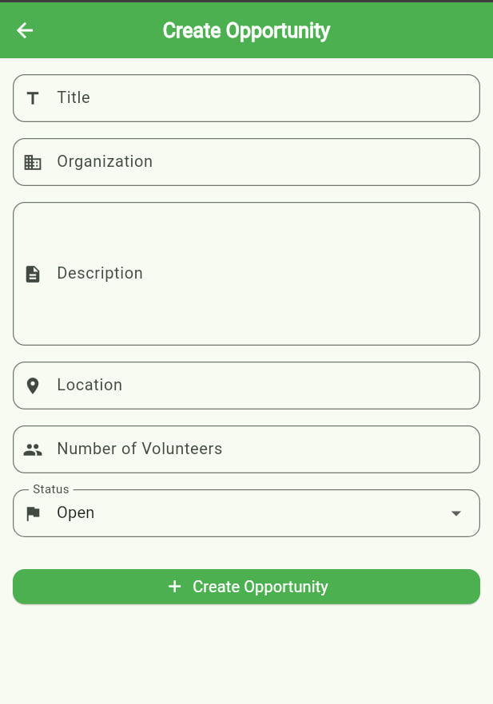
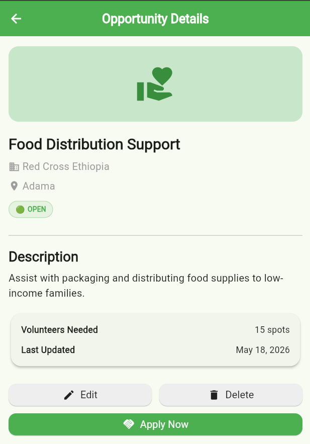
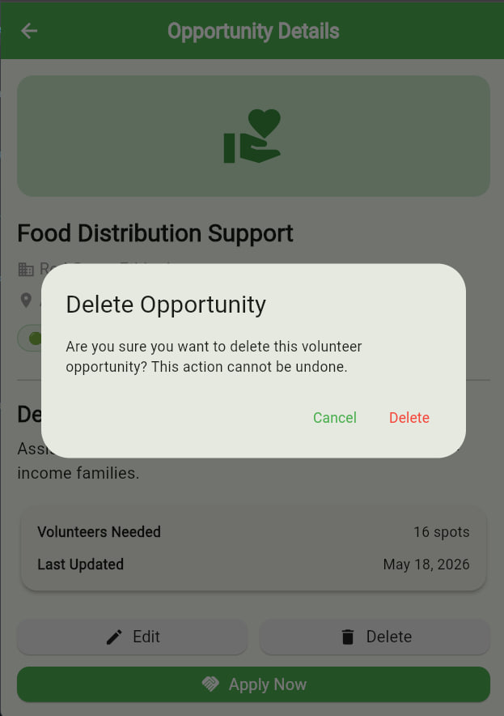
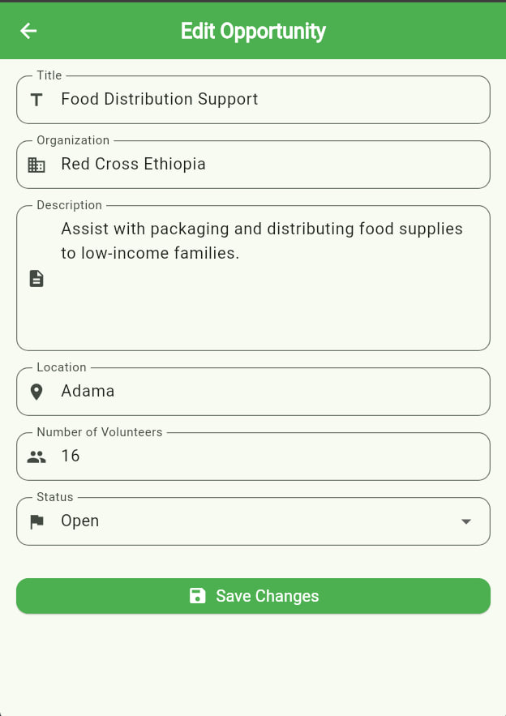

# ebise_tekleugr_9482_16

A Flutter volunteer opportunity app with create/edit and list screens.

## What it is

This app manages volunteer opportunities using Flutter and `flutter_bloc`.
It includes screens for listing opportunities, creating new ones, editing details, and deleting entries.

## How to run

1. Open the project folder.
2. Install dependencies:

```bash
flutter pub get
```

3. Run on Chrome or another device:

```bash
flutter run -d chrome
```

## App flow

1. Load volunteers
   - App starts and fetches data from the API
   - Event: `LoadVolunteersEvent`
   - State: `VolunteerLoaded`
2. Create volunteer
   - User fills the form
   - Event: `AddVolunteerEvent`
   - API POST request
   - The list updates automatically
3. View details
   - Tap a card to open the detail screen
   - Event: `LoadVolunteerDetailEvent`
4. Update volunteer
   - Edit form submitted
   - Event: `UpdateVolunteerEvent`
   - API PUT request updates the data
5. Delete volunteer
   - Confirmation dialog appears
   - Event: `DeleteVolunteerEvent`
   - API DELETE request removes the item
6. Apply for volunteer
   - Increases the number of volunteers
   - Prevents apply action if status is `filled`

## Screenshots











## Key files

- `lib/main.dart` — app entry point
- `lib/screens/volunteer/create_volunteer_screen.dart` — create volunteer form
- `lib/screens/volunteer/edit_volunteer_screen.dart` — edit volunteer form
- `lib/blocs/volunteer/volunteer_bloc.dart` — bloc logic
- `lib/blocs/volunteer/volunteer_state.dart` — volunteer states
- `lib/models/volunteer.dart` — volunteer model

